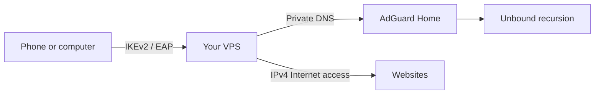

# Single VPS VPN Gateway

A self-hosted VPN on one VPS, using **strongSwan IKEv2/EAP**, **AdGuard Home** for DNS-based ad and tracker blocking, and **Unbound** for recursive DNS. The server's public IPv4 is the address websites see. The template does not assume a provider, country, hostname, or user account.



## What this installs

- strongSwan IKEv2 with a private certificate authority and an initial EAP user.
- IPv4 full-tunnel forwarding and NAT through the VPS, with forwarding restricted to authenticated IPsec traffic.
- An IPv6 tunnel address and a server-side IPv6 sink. The generated Android profile blocks IPv4 and IPv6 traffic outside the VPN; client behavior still needs a real-device test.
- AdGuard Home on a private VPN-only address. Its dashboard is password-protected and is not bound to the public interface.
- Unbound on localhost as AdGuard's recursive upstream, with no public DNS fallback.
- The [official AdGuard DNS filter](https://github.com/AdguardTeam/HostlistsRegistry) and no per-query history by default.

DNS filtering cannot remove ads served from the same domain as the desired content. Applications with their own encrypted DNS can bypass the VPN's DNS setting. A VPN also cannot hide GPS, account identity, cookies, or device fingerprints.

## Requirements

- A **fresh Ubuntu 24.04** VPS with a public IPv4 address and `x86_64` or `aarch64` CPU. The installer refuses an existing strongSwan/AdGuard setup.
- Root or sudo access, outbound HTTPS for downloads, and outbound DNS for Unbound recursion.
- Provider firewall access: allow inbound **UDP 500 and 4500**. Keep SSH open for administration. Do not expose TCP/UDP 53 or TCP 3000 publicly.
- A DNS hostname pointing to the VPS, or its public IPv4 as `SERVER_ID`.
- A strong, unique VPN password. For automated runs, place it in a root-only file (mode `0600`) outside the repository.

Choose `CLIENT_POOL`, `IPV6_SINK_POOL`, and `DNS_IP` that do not overlap the VPS network, local LANs, or other VPNs. Defaults are `10.252.0.0/24`, `fd42:252::/64`, and `10.254.0.1`.

## Install

Run on the **new VPS**:

```bash
sudo apt-get update && sudo apt-get install -y git
git clone https://github.com/VictorBoykoV/single-vps-vpn-gateway.git
cd single-vps-vpn-gateway
sudo SERVER_ID='vpn.example.net' VPN_USER='alice' ./scripts/install.sh
```

Replace the example hostname and username. The installer prompts for the VPN password. For unattended installation, add `VPN_PASSWORD_FILE=/root/vpn-password` after creating that file with mode `0600`; do not put the password in shell arguments, source code, Actions secrets of a public operational repo, or Git history.

The installer pins and verifies the AdGuard Home v0.107.79 release archive. It prints paths to the public CA certificate and the root-only AdGuard dashboard login. Installation requires several minutes and ends with server-side DNS and filtering checks. It does **not** modify an existing VPN; deploy to a fresh VPS and migrate clients after testing.

## Connect a device

The VPN username is the value supplied as `VPN_USER`; the password is the one entered during installation. The server address and identity must match `SERVER_ID` exactly.

For Android strongSwan, generate a password-free `.sswan` file on the VPS:

```bash
sudo SERVER_ID='vpn.example.net' VPN_USER='alice' \
  CA_CERT_FILE=/root/single-vps-vpn/ca.pem \
  OUTPUT_FILE=/root/single-vps-vpn/client.sswan \
  ./scripts/generate-android-profile.sh
```

Copy that file to your phone over a trusted channel, import it in the strongSwan app, and enter the VPN password there. If large pages fail while small pages work, regenerate with `PROFILE_MTU=1280`, then import and test that profile. The profile includes an IPv4/IPv6 outside-VPN block and does not contain your password.

For Apple devices, use `scripts/generate-apple-profile.sh` with the same `SERVER_ID`, `VPN_USER`, `CA_CERT_FILE`, and a `.mobileconfig` output path. Review the installed CA/profile on the device. See [client setup](docs/CLIENTS.md) for manual setup and verification.

Once connected, open `http://10.254.0.1:3000` (or your chosen `DNS_IP`) for the AdGuard dashboard. Retrieve its login from `/root/single-vps-vpn/adguard-login.txt` on the VPS. The dashboard uses HTTP inside the encrypted VPN tunnel and is not publicly exposed.

## Verify and operate

On the VPS:

```bash
sudo ./scripts/verify.sh
```

Then test from the actual device on both Wi-Fi and mobile data: VPN connection, website loading, public IPv4, DNS, and absence of unexpected public IPv6. Server-side checks alone cannot prove client reachability or leak protection. See [client checklist](docs/CLIENTS.md), [operations](docs/OPERATIONS.md), and [troubleshooting](docs/TROUBLESHOOTING.md).

## Security and limitations

The VPS operator and hosting provider can observe the server and its Internet traffic. Standard DNS is protected between the device and VPS by IPsec, but Unbound sends ordinary DNS queries to authoritative servers unless you replace that design. The template deliberately keeps DNS and the dashboard on a private address and refuses installation over an existing configuration. Protect `/root/single-vps-vpn`, rotate credentials when a device is lost, and apply Ubuntu and AdGuard Home security updates. The pinned AdGuard version should be refreshed deliberately after reviewing its release and checksum.

Licensed under [MIT](LICENSE). Uses [strongSwan](https://docs.strongswan.org/docs/latest/), [AdGuard Home](https://github.com/AdguardTeam/AdGuardHome), and [Unbound](https://nlnetlabs.nl/projects/unbound/about/).
